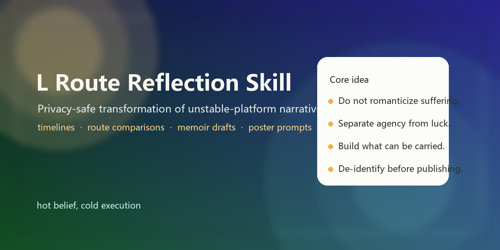

# L Route Reflection Skill

A privacy-safe reflection skill for turning unstable-platform career narratives into structured outputs: timelines, route comparisons, memoir drafts, poster prompts, and risk/benefit audits.

## What It Does

This skill is designed for stories that involve:

- unstable institutions
- broken training pipelines
- fragile loyalty to mentors, departments, or platforms
- self-reconstruction through portable skills
- later reinterpretation of suffering, luck, and agency

It helps turn raw recollection into outputs that are:

- de-identified by default
- emotionally honest
- structurally clear
- reusable across literary, analytical, and visual formats

## Included Files

- `SKILL.md`
  The main skill instructions and workflow.
- `templates.md`
  Reusable templates for timelines, route comparisons, audits, and essay prompts.
- `examples.md`
  Short examples showing how the skill can be applied.
- `CHANGELOG.md`
  Version history for public releases.
- `release-process.md`
  Lightweight release-note and version-maintenance guidance.

## Best Use Cases

- memoir drafting
- career reflection
- unstable institution debriefing
- transformation of chat logs into essays, tables, and poster prompts
- public-safe adaptation of sensitive personal narratives

## Core Principles

- Do not romanticize suffering.
- Distinguish platform value from personal recovery.
- Distinguish agency from luck.
- Treat gratitude, loyalty, and dependence as separate concepts.
- Default to aliases and de-identification unless a private archive is explicitly requested.

## Suggested Output Set

For a strong first pass, use this skill to generate:

1. a de-identified timeline
2. a route comparison table
3. a risk/benefit audit
4. a 2500-3500 word public-safe memoir draft
5. a 6-poster image prompt set

## Safety Default

This repository is intentionally public-safe.

It avoids:

- real names
- patient details
- rare searchable combinations
- unsupported accusations framed as verified fact

## Project maintenance

- [CHANGELOG.md](./CHANGELOG.md)
- [release-process.md](./release-process.md)
- [.github/release-template.md](./.github/release-template.md)

## License

Released under the MIT License.
