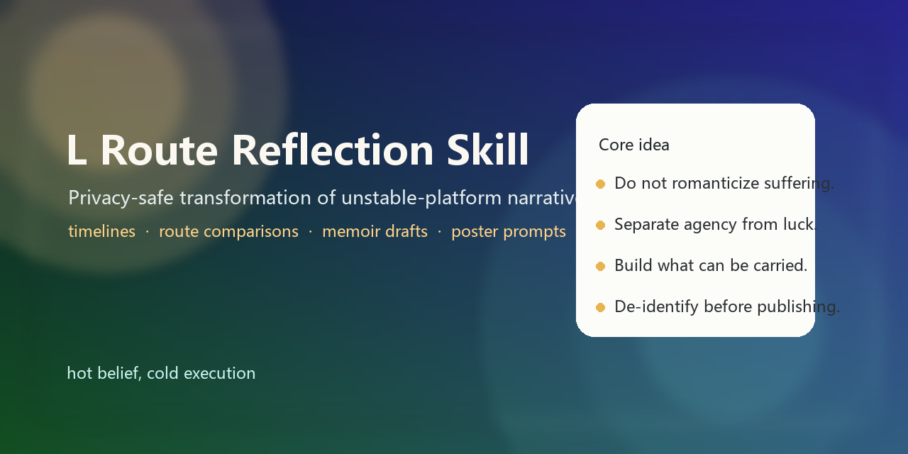

# L Route Reflection Skill



[](https://github.com/sushuqiong/l-route-reflection-skill/releases)


A skill for candid, evidence-bounded reflection on unstable institutions,
career rupture, family or mentor pressure, changing alignments, and later
success or failure. It supports private analysis and privacy-enhanced public
adaptation without treating aliases as anonymity.

## What It Improves

- separates observation, recollection, inference, later evidence, and
  counterfactual claims
- fixes the historical information set before judging a past decision
- compares feasible branches without hindsight bias or false precision
- distinguishes concern from coercive effect, and adaptation from betrayal
- separates agency, prior assets, institutional conditions, timing, and luck
- preserves uncomfortable errors without forcing hero, victim, or villain
  narratives
- applies a public-release gate for direct identifiers, quasi-identifiers,
  third-party details, metadata, and rare identifying combinations

## Repository Structure

- [`SKILL.md`](./SKILL.md): core routing, reasoning workflow, and quality gate
- [`templates.md`](./templates.md): reusable analytical and public-safe output
  structures
- [`examples.md`](./examples.md): deliberately generic examples
- [`references/analysis-frameworks.md`](./references/analysis-frameworks.md):
  counterfactual, power, relationship, and professional-boundary methods
- [`references/privacy-release.md`](./references/privacy-release.md): manual
  privacy and repository release gate
- [`scripts/privacy_scan.py`](./scripts/privacy_scan.py): local scanner for
  common identifiers and secrets

## Quick Start

Ask for the smallest useful output, for example:

```text
Use $l-route-reflection-skill to assess this decision from what was knowable at
the time. Separate facts, inference, hindsight, and realistic counterfactuals.
```

For a public artifact, first minimize the source narrative. Then run:

```powershell
python scripts/privacy_scan.py . --git-metadata --fail-on high
```

The scanner also flags non-`noreply` Git author and committer emails. It does
not prove anonymity. Complete the manual acquaintance and rare-combination
review in `references/privacy-release.md` before publishing.

## Safety Position

This repository contains abstract methods and composite examples, not a source
chronology. Public outputs should omit real names, patient information, exact
local paths, searchable quotations, and distinctive combinations of dates,
roles, institutions, and incidents.

## Maintenance

- [CHANGELOG.md](./CHANGELOG.md)
- [release-process.md](./release-process.md)
- [.github/release-template.md](./.github/release-template.md)

## License

Released under the MIT License.
